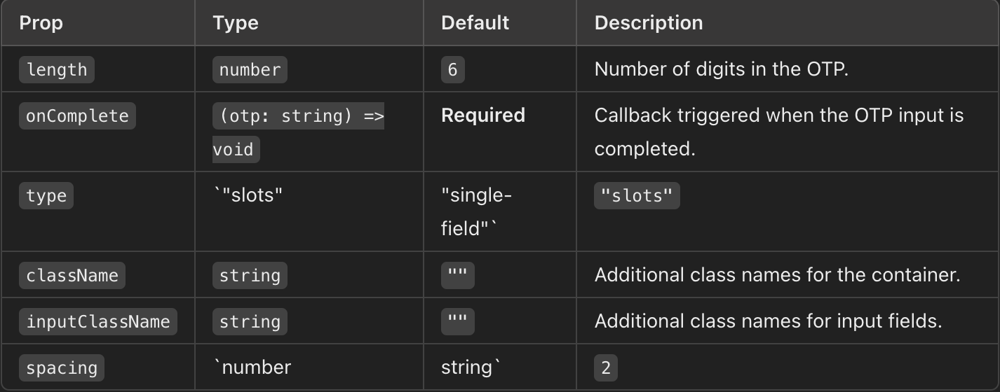

# SmoothOTP Component

The `SmoothOTP` component is a flexible and user-friendly React component for inputting One-Time Passwords (OTPs). It supports two modes (`slots` and `single-field`), copy-pasting in the `slots` mode (including support for Android and iOS), and customizable styling.

## Features

- **Two Modes**:  
  - `slots`: Separate input boxes for each OTP digit.  
  - `single-field`: A single input box for the entire OTP.  

- **Copy-Paste Support**: Allows users to paste the OTP directly into the `slots` mode, with the pasted value distributed across the fields automatically.  

- **Keyboard Navigation**:  
  - Auto-focus on the next field after entering a digit.  
  - Backspace moves focus to the previous field if the current field is empty.  

- **Customization**:  
  - Configurable length of OTP.  
  - Custom class names for styling.  
  - Adjustable spacing between inputs in `slots` mode.

## Installation

```bash
npm install smooth-otp
```

## Component API



## Example Usage

```bash
import React from "react";
import { SmoothOTP } from "./SmoothOTP";

const App = () => {
  const handleComplete = (otp: string) => {
    console.log("Completed OTP:", otp);
  };

  return (
    <SmoothOTP
      length={6}
      type="slots"
      onComplete={handleComplete}
    />
  );
};

export default App;
```

## Advance Customization 

```bash
<SmoothOTP
  length={4}
  type="slots"
  onComplete={(otp) => console.log(otp)} 
  className="custom-otp-container"  // you can use tailwind classes here for outer layer
  inputClassName="custom-otp-input" // you can use tailwind classes here for inner layer
  spacing={10}
/>
```

## Contributing
- We welcome contributions! Follow these steps:
- Fork the repository.
- Create a branch for your feature or bug fix.
- Submit a pull request describing your changes.


## License
This project is licensed under the MIT License.


## Upcoming Features 
- AUTO OTP Read for mobile devices (Android / IOS)
- AUTO OTP Read for desktop browsers (https://developer.chrome.com/docs/identity/cross-device-webotp)
- ARIA attribute addition